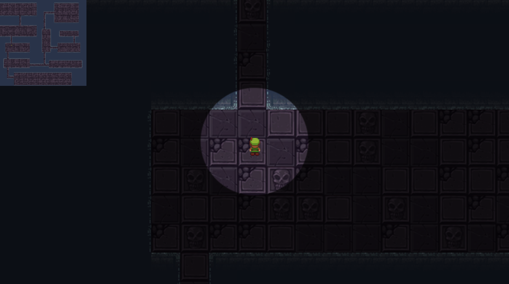

## Procedural Generation Dungeon Level Creator
 - As part of my Game Mechanics course I created top-down level generator that uses procedural generation to algorithmically create the level.  This was done using C# and the Unity Game Engine. The final product showcases a generated level in which the user can navigate around as well 
as a map in the corner to display what the new level looks like.

### Running the project
- The full folder can be opened and executed within Unity Game Engine. 

### Final Result 

